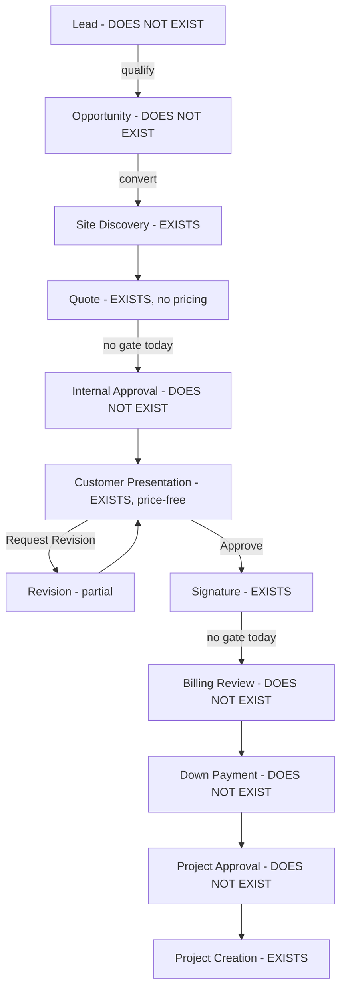
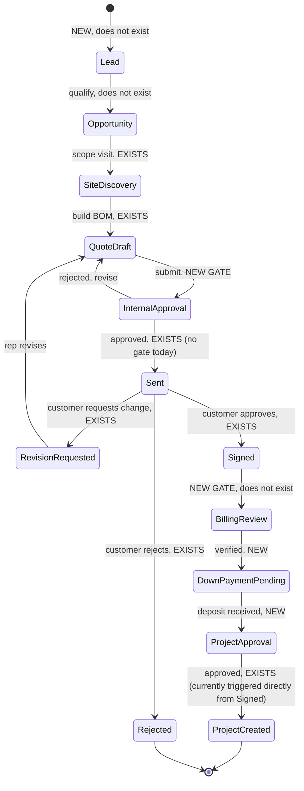

# Ergon Sales Capability Map & Journey Design

**Scope note:** `PRODUCT_PLAN.md` already contains a "Sales and quoting" section (lines 113-135)
that states the target — combining HubSpot-style CRM/pipeline with PandaDoc-style document/
e-signature capability, with a full Billing/Projects handoff. This document does not duplicate
that section; it extends it with an evidence-based current-state audit, a stage-by-stage journey
design, an information architecture, wireframe-level flows, and test/rollout plans, all traceable
to actual code and migrations in this repository. Read it as the detailed backing document for
that section, not a competing plan — the same relationship `PRODUCT_TENANCY_AUDIT.md` has to
`PRODUCT_PLAN.md`'s tenancy section.

Produced as Priority 6 of the 2026-09-08 overnight work queue. Planning/discovery only — no Sales
UI code was touched or replaced to produce this document.

---

## 1. Current-state capability map

### 1.1 What Ergon's Sales module provides today (verified against code)

**Core entity: `sales_quotes`** (`backend/supabase/migrations/033_phase_catalog_manager_gate_and_quote_builder.sql:32-41`) — a flat table keyed by `client_name text not null` (free text, no FK to any client entity at creation time — `client_id` was bolted on later, nullable, and only partially backfilled: `102_clients.sql:44-45,68-70` shows only 3 of the quotes with matching client names actually got linked). Frontend component: `SalesQuoteBuilder` (`src/main.tsx:22121-22259` for props/state; renders in two modes, `list` and `detail`).

| Capability | Evidence | Notes |
|---|---|---|
| Create a quote (client/site/city) | `createSalesQuote()` `persistence.ts:8542`; `sales_quotes` table `033:32-41` | `client_name`/`site_name` are free text, not linked to a CRM entity by default |
| Per-site "New Site" intake sheet, editable after creation | `main.tsx:22287-22306` | |
| Locations (garages/lots) with FLI/LPR/people-counting flags, entry/exit/level counts | `sales_quote_locations` `033:64-101` | |
| Real catalog-linked camera model per location (FLI/LPR/people-counting) | `056_location_hardware_lines.sql:6-10` | |
| Addable Sign / Space Sensor / Misc / VPU line items per location, linked to catalog | `056:21-42`; UI drafts `main.tsx:22279-22286` | |
| In-app camera capture + uploaded drawings per location, each with a short description and GPS coords | `sales_quote_location_images` `033:103-121`; `044_quote_image_description.sql:5`; `addSalesQuoteLocationImage` `persistence.ts:9127` | Storage bucket `sales-quote-images`, private, authenticated-only (`033:124-147`) |
| Pre-Sales Quick Estimate (tier/node-count/cloud-sync → baseline hardware) | `presales_hardware_rules` `028_phase20_presales_hardware_rules.sql:8-57`; UI `onGenerateBaselineBom` | Admin-configurable rule table, not code |
| Persisted, editable BOM per quote (item/qty/notes, optionally catalog-linked) | `sales_quote_bom_lines` `048_sales_quote_status_and_bom.sql:12-32`; `catalog_item_id` added `053_sales_quote_proposals.sql:26` | Free-text item rows (e.g. "Project Management Hours") coexist with catalog-linked rows |
| Deal status: open / closed_won / closed_lost, with `closed_at` | `048:10`; `066_sales_quote_ref_and_closed_at.sql:33-34` | This is the entire "pipeline" — a 3-value status, not stages |
| Stable, atomically-assigned quote reference (`SQ-2026-0001`) | `066:14-61` (counter table + trigger, race-safe) | |
| Site Intake Questionnaire — admin-configurable, admin-buildable client-facing question set | `058_sales_site_intake_questionnaire.sql`; real question set `059_sales_site_intake_real_questions.sql:29-70` | Built on the generic Fluid Form Engine — genuinely no-code (`PRODUCT_TENANCY_AUDIT.md` §5 confirms no hidden fixed list behind this panel) |
| Client-facing proposal generation from BOM + shared boilerplate template | `sales_quote_proposals` `053:103-119`; boilerplate sections `053:38-97` | Snapshot-frozen at send time (`content_snapshot jsonb`) |
| Public, tokenized, no-login proposal page with Approve / Reject / Request Revision | `ProposalPublicPage` `main.tsx:24794-24931`; RPCs `get_quote_proposal_by_token`/`respond_to_quote_proposal` `053:147-205`, notification wiring `054_quote_proposal_responded_notification.sql` | |
| Proposal versioning (v1, v2, v3…) | `nextVersion = Math.max(...existing.map(v => v.version)) + 1` `main.tsx:4978` | Each version is a new frozen snapshot — no diff/redline view |
| Lightweight "e-signature" | `approval_name`, `approval_ip`, `approval_content_hash` (SHA-256 of the exact snapshot approved) `053:113-116`, computed in `respond_to_quote_proposal()` `053:198-199` | Typed name + IP + content-hash, not a drawn/certificate-based signature |
| Proposal email delivery, role-gated | `api/send-proposal-email.js:37` (`sales`/`pm`/`manager` only) | Falls back to "Copy client link" if email isn't configured |
| Quote → Task linking ("Request" button creates a task tied to the quote) | `tasks.quote_id` `037_task_quote_link.sql:8-10` | |
| Auto-create a Project from a Closed-Won quote | `createProjectFromClosedWonQuote()` `persistence.ts:10079-10288`; triggered from `handleStatusChange` `main.tsx:22426-22436` with a confirm dialog | See §1.5 for exactly what does/doesn't transfer |
| Sales dashboard KPIs: Quotes, Open, Closed This Year, Win Rate, Avg Deal Size, Est. Profit (YTD) | `main.tsx:18266-18308` | Profit/deal-size are computed live from the catalog item's *current* cost/markup, not a value locked in at quote time — see §1.4 point 5 |
| `clients` entity (name + auto-created permanent channel) | `102_clients.sql:32-42,72-96` | Exists but functionally disconnected from the live create-quote flow — no UI creates a client directly; `client_id` on `sales_quotes`/`projects` is nullable and unenforced (`PRODUCT_PHASE2_PLAN.md` §1) |

### 1.2 What HubSpot provides that Ergon's Sales module does not

Based on HubSpot's current CRM/Sales Hub feature set (companies/contacts as first-class deduplicated records, a visual deal pipeline with configurable stages, deal-stage automation, activity timelines spanning calls/emails/meetings, lead scoring, sequences, forecasting, and multi-touch attribution):

- **No Lead or Opportunity entity at all.** Confirmed by direct grep of `main.tsx` for "opportunity"/"lead"/"pipeline"/"deal stage" — the only hit is decorative copy on the Sales tab and unrelated vendor "lead times" text. `PRODUCT_TENANCY_AUDIT.md` §2 independently confirms: *"Opportunity — Not found. No CRM pipeline/opportunity table exists in the current schema."* A `sales_quote` is created directly — there is no pre-quote stage to track a prospect who hasn't been scoped yet.
- **No deal-stage pipeline.** `sales_quotes.status` is a 3-value enum (`open`/`closed_won`/`closed_lost`) with no intermediate stages (Discovery, Site Survey, Proposal Sent, Negotiation, etc.) and no stage-change history/timestamps beyond `closed_at`.
- **No Contact entity.** `PRODUCT_TENANCY_AUDIT.md` §2 confirms: *"Contact — No dedicated table found."* Today a quote carries `contact_full_name`/`contact_phone`/`preferred_communication` as flat text columns on `sales_quotes` itself (`060_sales_quote_contact_fields.sql:8-10`) — one contact per quote, not a reusable person record with a history across deals.
- **No activity timeline** (calls, emails, meetings, notes) attached to a client/contact/deal. The closest thing is the generic `channels`/`conversations` messaging system (per-client channel), which is a chat feed, not a structured CRM activity log.
- **No lead scoring, sequences, or marketing automation** — none of this exists in schema or UI, and per `PRODUCT_PLAN.md` these are explicitly future ("Marketing" module) scope.
- **No forecasting or attribution reporting** beyond the six flat KPI tiles in §1.1 — no weighted pipeline value, no stage-conversion funnel, no source/campaign attribution.
- **No duplicate-protection or company/contact merge tooling** — `clients.name` is merely `unique`, so the only "duplicate protection" is a hard rejection on exact-name collision, not fuzzy matching or a merge flow.

### 1.3 What PandaDoc provides that Ergon's Sales module does not

- **No pricing shown to the customer at all.** This is the single largest gap. `buildProposalSnapshot()` (`main.tsx:4928-4956`) builds the BOM rows sent to the client with only `item`, `qty`, `description`, `imageUrl`, `datasheetUrl` — **no price, no line total, no grand total, no tax, no payment-terms number are ever included in `content_snapshot`.** `ProposalPublicPage`'s rendered table has columns `[thumbnail, Item, Description, Qty, Datasheet]` — no price column exists in the markup. Every dollar figure in the app is computed for *internal* dashboard KPIs only and is deliberately excluded from anything the client sees (per the code comment at `053_sales_quote_proposals.sql:145-146`: "never quote internal cost/markup data"). In its current form, Ergon cannot replace PandaDoc for the job PandaDoc actually does — quoting a customer a price.
- **No customer-facing pricing interactivity** — no toggleable optional upgrades, no quantity editing by the customer, no accept-a-subset-of-line-items flow.
- **No real e-signature.** The "signature" is a typed name + captured IP + a SHA-256 hash of the approved content — legally weaker than PandaDoc's certificate-backed, identity-verified e-signature (no email-verification loop back to the named signer, no multi-party/countersignature support, no signing-order routing).
- **No PDF generation.** The proposal is an HTML page with a browser Print/Save-as-PDF affordance (explicitly noted as intentional v1 scope in `053_sales_quote_proposals.sql:8-10`: "no PDF-generation library exists in this app yet").
- **No document engagement analytics** — no "customer opened / viewed page 3 / spent 2 minutes on pricing" tracking.
- **No branded presentation themes** — the public page uses one fixed CSS treatment (shared with the unrelated Submittals feature), with no per-company branding, color themes, or section-reordering control.
- **No redline/negotiation trail** — "Request Revision" simply flips proposal status; there's no structured comment/redline exchange.

### 1.4 Where a real user would switch systems, re-enter data, or hit friction

1. **Client identity never becomes real, end-to-end.** A quote starts with free-text `client_name`. `createProjectFromClosedWonQuote()` (`persistence.ts:10113-10130`) **never writes `client_id`** to the new project — confirmed by reading the full `projectPayload` object and the surrounding function through its final return — no `client_id` field appears anywhere. Even in the one place the app already has a real `clients` table, the quote→project handoff silently drops the link.
2. **No price ever reaches the customer inside Ergon** — a real user almost certainly builds the actual priced quote/proposal in PandaDoc (or email/a spreadsheet) and uses Ergon's proposal only for the BOM/spec/photo side. This is the sharpest system-switching point.
3. **No CRM pipeline stage before "quote exists."** A rep working an early-stage lead has nowhere to put it in Ergon.
4. **No internal approval before a proposal is sent.** `handleCreateQuoteProposal()` (`main.tsx:4967-5007`) creates and emails the proposal in one step — there is no manager sign-off path analogous to the existing Catalog Price Change Requests propose/review/approve pattern.
5. **Margin/profit isn't locked at quote time.** `estimatedProfitYtd`/`avgDealSize` (`main.tsx:18266-18297`) recompute against the catalog item's *current* `unitCost`/`markupPercent` — a catalog price change after a quote closes silently rewrites that quote's historical reported profit.
6. **Billing Review, Down Payment, and Project Approval don't exist as gates.** A grep for "billing review"/"down payment"/"deposit" across `main.tsx` returns zero matches. `handleStatusChange()` moving a quote to `closed_won` immediately offers, via a plain `window.confirm()`, to create the Project — no intermediate commercial-review or deposit-collection step exists. Matches `PRODUCT_PLAN.md`'s own framing of "Signed Quote → Billing Review → Down Payment → Project Approval → Project Created" as the *first priority handoff still to be built* (`PRODUCT_PLAN.md:235-237`), not something already working.

### 1.5 What Billing and Projects actually receive today from a closed-won quote

Traced directly from `createProjectFromClosedWonQuote()` (`persistence.ts:10079-10288`):

- **Copied:** site name → `project_name`; client name (text only, no `client_id`) → `customer_name`/`billing_name`; computed site type from location counts; site address; camera count; SaaS type/contract amount/billing frequency; one-time sale amount; contact phone; billing address; every BOM line (status reset to `"Not started"`); every location (with camera/sensor/sign flags and linked catalog items, entry/exit/level counts) as `project_locations`, each carrying `source_quote_location_id` back to the originating quote location; every sign/sensor/misc line item per location; every photo/drawing per location, storage-object-copied (not just referenced) into `project-location-images` with GPS/description preserved and `origin: "sales"` tagged.
- **Not copied / not present:** `client_id`; any price, cost, margin, or discount data (none exists on the quote to copy); the site-intake questionnaire responses; the proposal itself or its approval/signature record; any Billing-stage record; the quote's own `quote_ref` is not stamped onto the project (the project gets its own separate `PRJ-2026-####` ref via a different, client-side mechanism, fixed 2026-09-08 for its own hard-coded-year bug — see `HANDOFF.md`).
- **Project starts in `app_status: "Draft"`** with no gate checking whether Billing has verified anything.

---

## 2. Full journey requirements

| Stage | Exists in Ergon today? | Evidence | Requirement to build |
|---|---|---|---|
| **Lead** | **No.** | `PRODUCT_TENANCY_AUDIT.md` §2; grep confirms no lead concept. | New `leads` table (workspace-scoped from its first migration, per `PRODUCT_PHASE2_PLAN.md` §10 working decision #10): source, contact info, qualification status, owner, timestamps. |
| **Opportunity** | **No.** | `048:10`; confirmed absent. | New `opportunities` table with admin-configurable stages, stage-change history, owner, estimated value, expected close date. |
| **Site Discovery** | **Partially exists**, not modeled as its own stage. | Site Intake Questionnaire (`058`,`059`) + Site Builder (`033`,`044`,`056`) — Ergon's most mature stage today. | Keep structurally; add a visible "Discovery" status/checklist connecting to whatever Opportunity record exists. |
| **Quote** | **Yes, mature.** | §1.1. | Add real pricing (unit price, line total, discount, tax, grand total); lock a price/cost snapshot per BOM line at freeze time. |
| **Internal Approval** | **No.** | Grep confirms zero approval logic. | Reuse the existing Catalog Price Change Requests propose/review/approve pattern with configurable thresholds. |
| **Customer Presentation** | **Yes, but price-free.** | §1.1/§1.3. | Add pricing display, optional/upgrade toggles, branded theme layer. |
| **Revision** | **Partially exists** via versioning, no redline trail. | `main.tsx:4978`. | Add a "what changed since v(n-1)" diff view and a structured revision-request reason. |
| **Signature** | **Yes, lightweight.** | §1.1/§1.3. | Adequate for v1 internal use; legal-weight gap noted for a fully binding external-facing need. |
| **Billing Review** | **No.** | Zero code references. | New stage: lock the quote as an immutable commercial snapshot on proposal-approved, route to a Billing queue. |
| **Down Payment** | **No.** | `PRODUCT_TENANCY_AUDIT.md` §2: "Billing account — Not found." | New billing-account/deposit-tracking record; gate project creation on required deposit. |
| **Project Approval** | **No** as a distinct gate. | `main.tsx:22426-22436` (`window.confirm()`). | Replace the confirm-dialog auto-create with an explicit approval step. |
| **Project Creation** | **Yes, mature**, incomplete carryover. | §1.5. | Fix the `client_id` gap; stamp the originating `quote_ref` onto the project; gate on Billing/deposit once those stages exist. |

Today's *actual* live path, for contrast — what a rep can do end-to-end without leaving Ergon:
**Quote (no price) → Customer Presentation (no price) → Signature → confirm() dialog → Project
Creation.** Every gap named above is real, not a UI polish item.

---

## 3. Essential first-release CRM capabilities vs. later HubSpot-level capabilities

### 3.1 Essential for Ergon's own first-release standalone use

1. **Real pricing on the quote and proposal** — the single highest-priority gap; without it Ergon cannot functionally replace PandaDoc regardless of anything else built.
2. **A minimal Opportunity/pipeline concept** — a simple, admin-configurable stage list, not HubSpot's full sophistication on day one.
3. **A real, reused Contact entity** — promote today's flat quote-level contact columns into a proper `contacts` table linked to `clients`.
4. **Fix the `client_id` handoff gap** — a small, surgical fix, not new capability.
5. **Internal approval gate before a proposal is sent** — reuse the existing Catalog Price Change Requests pattern.
6. **Billing Review → Down Payment → Project Approval as real gates**, per `PRODUCT_PLAN.md`'s own stated first-priority handoff — already-approved product direction, not a new proposal.
7. **Customer-facing optional/upgrade line items and a downloadable, consistently-formatted PDF.**
8. **A basic activity log per client/opportunity** — does not need full HubSpot-grade automation.

### 3.2 Later, HubSpot-level capabilities (genuinely lower priority)

Marketing automation/drip sequences/lead scoring; multi-touch attribution and campaign ROI
(blocked anyway on the Marketing module not existing); advanced AI-forecasting/deal-scoring;
territory/quota management and per-rep leaderboards (not meaningful at Ergon's current team
size — the existing KPI code explicitly declines to build ARR/MRR/CAC tracking today, citing "no
real data to compute them from," `main.tsx:18283-18286`); email sequence/cadence automation,
meeting-scheduler embeds, call recording/transcription; document engagement analytics; full
certificate-backed e-signature with identity verification (today's model is adequate for an
internal tool with already-trusted counterparties).

---

## 4. Guided quote-builder information architecture

Describes flow and grouping, not a UI mockup — extends the existing `SalesQuoteBuilder`.

1. **Client / Site** *(exists)* — should resolve to a real `clients`/`contacts` record, not free text.
2. **Job Template** *(new)* — admin-defined starting shape pre-populating expected location types, a default BOM skeleton, and applicable Site Intake questions. Optional/skippable.
3. **Locations** *(exists)* — `sales_quote_locations`, `056`.
4. **Products and Bundles** *(mostly exists, bundles thin)* — catalog already supports a lightweight "bundle" with a free-text `SKU:qty` components field (`main.tsx:18760-18789`); should become a real structured bundle-explosion.
5. **Labor and Recurring Services** *(partially exists)* — free-text one-time labor lines today; SaaS fields carry through to the Project already; needs promotion to structured recurring line items.
6. **Margin and Approvals** *(new)* — per-line cost/markup snapshot at freeze time; triggers Internal Approval past a configurable threshold.
7. **Scope and Exclusions** *(exists as static boilerplate)* — shared `proposal_template_sections` (`053:38-97`); per-deal overrides not currently possible.
8. **Customer Options** *(new)* — mark BOM lines as optional/toggle-able for the customer.
9. **Presentation Preview** *(new)* — "view as customer will see it" before sending, matching `PRODUCT_PLAN.md:248`'s stated UX principle.
10. **Signature and Handoff** *(exists)* — then routes through Billing Review/Down Payment/Project Approval per §2, once built.

```mermaid
flowchart LR
    A["Client / Site"] --> B["Job Template - optional"]
    B --> C["Locations"]
    C --> D["Products and Bundles"]
    D --> E["Labor and Recurring Services"]
    E --> F["Margin and Approvals"]
    F --> G["Scope and Exclusions"]
    G --> H["Customer Options"]
    H --> I["Presentation Preview"]
    I --> J["Send for Signature"]
    J --> K["Billing Review"]
    K --> L["Down Payment"]
    L --> M["Project Approval"]
    M --> N["Project Created"]
```

---

## 5. Customer-facing proposal experience — today vs. a fuller version

### 5.1 What `ProposalPublicPage` does today (`main.tsx:24794-24931`)

Loads by token via `fetchPublicQuoteProposal(token)`, no login. Three phases: `loading` →
`ready`/`responded`. Header: site name, "Proposal v{n} – {clientName} – {city}", quote reference.
"Print / Save as PDF" via `window.print()` — the only PDF path. Executive Summary paragraph.
BOM table: thumbnail, item name + manufacturer, description, quantity, datasheet link — **no
price, no line total, no grand total.** Boilerplate sections from the frozen snapshot. Response
form (name, optional notes, Approve/Request Revision/Reject) calling `respond_to_quote_proposal`.
Single linear-scroll layout, class-shared with the unrelated Submittals feature.

### 5.2 What a fuller version needs

- **Pricing, front and center** — the single biggest functional gap.
- **Interactive optional/upgrade line items** with live total recomputation.
- **Visual hierarchy pass** — a summary/hero block above the fold, expandable/tabbed detail below, per `PRODUCT_PLAN.md:245`'s "concise summary first, details on demand" principle.
- **Images/video/diagrams beyond product thumbnails** — embed the site's own captured photos/drawings directly.
- **Branded presentation themes** — per-company logo/color/section-order control.
- **A real generated PDF**, server-rendered and downloadable independent of the browser.
- **Accessibility verification** — color contrast, keyboard-navigable response form, screen-reader labeling — not evaluated in this pass, flagged for the dedicated accessibility audit.
- **Explicit mobile layout verification** — the BOM table already carries a `stack-table-mobile` class, suggesting some handling exists; should be re-verified once pricing/interactivity are added, not assumed sufficient.

---

## 6. Wireframe-level flows

Quote-builder IA: see §4's diagram. Lead-to-project journey:

---

## 7. Sales usability-test script

**Scenario:** a normal, mid-complexity deal — a single-garage parking facility, FLI + LPR + two
internal signs, one site visit already completed with photos. Participant has never used the
feature under test before this session. Screen and think-aloud recorded; facilitator intervenes
only if fully blocked &gt;2 minutes.

**Tasks:** (1) create a new quote for the client/site; (2) add the garage location with correct
FLI/LPR/people-counting selections; (3) attach the two site photos; (4) add the two internal
signs as catalog-linked line items; (5) enter pricing and confirm the total matches a reference
total exactly; (6) submit for internal approval or mark ready to send; (7) send the proposal to a
test email; (8) open the proposal as "the customer" on a separate session and approve it; (9)
confirm what happens next in the rep's session.

**Completion criteria:** tasks 1-4 completed with no external tool and no "how do I" question;
task 5 total matches exactly, no hand calculation; task 6 participant can articulate the current
state and next actor unprompted; task 7 share link produced without help; task 8 "customer" reads
price/scope/terms and approves without asking what a button does; task 9 correct next action
identified. Overall: completion time under a to-be-set ceiling, zero critical errors (wrong price,
wrong client, wrong recipient), SUS score ≥ 70.

---

## 8. Baseline measures to track

Quote creation time (New Site submit → first BOM line saved → ready-to-send); systems opened per
quote (self-report checklist, since this can't be measured from Ergon's logs alone); duplicate
data entries (measurable once §3.1's Contact entity exists, by diffing submitted values against
existing records); correction cycles (`sales_quote_proposals.version`, already tracked, no new
instrumentation needed); time from signature to Billing (requires §2's new Billing Review record);
time from deposit to project (today this is "0, because the step doesn't happen" — the honest
pre-gate baseline); missing-information returns (the Site Intake Questionnaire's existing "x/y
answered" indicator, `main.tsx:22347-22351`, is a ready-made proxy today); whether a salesperson
can complete a quote without help (§7's pass/fail criteria, tracked longitudinally across
releases).

---

## 9. HubSpot/PandaDoc transition plan (planning only — no integration built, no external connections)

**Principle:** never require re-entering the same deal's data twice. Ergon absorbs work away from
HubSpot/PandaDoc feature-by-feature, only once the equivalent capability is proven — not all at
once.

**Phase 0 — Coexistence, instrumented (today → pricing capability lands).** Reps keep using
HubSpot for pipeline and PandaDoc for priced proposals; Ergon continues owning Site Discovery/BOM/
photos, exactly as today. Changes nothing — names the current real state as the transition's
starting line.

**Phase 1 — Ergon absorbs pricing and customer presentation** (§3.1 items 1, 7). Once real
pricing/PDF/optional-line-item support exists, pilot a small number of new deals where the
proposal is built and sent from Ergon instead of PandaDoc, while the deal/pipeline stage still
lives in HubSpot (linked manually, not synced). Move to Phase 2 only once pilot proposals close
at the same or better rate with no missing-price/missing-term incidents.

**Phase 2 — Ergon absorbs Opportunity/pipeline tracking** (§3.1 item 2). New deals enter Ergon's
pipeline directly; existing in-flight HubSpot deals are **not** migrated mid-flight — they finish
out in HubSpot while every new deal starts in Ergon. This one-way, new-deals-only cutover avoids
any bulk data migration/reconciliation risk.

**Phase 3 — Full Billing/Project gate live** (§2's remaining rows). The entire lifecycle from
Opportunity through Project Creation runs inside Ergon for every new deal; HubSpot/PandaDoc
become read-only historical archives for pre-cutover deals.

**What this plan deliberately does not do:** no API integration to HubSpot or PandaDoc is
proposed or should be built at any phase — the transition is a *behavioral* cutover (reps use the
new Ergon capability once it exists for new work), not a data-sync integration. This avoids the
two most common causes of duplicate-entry pain in a tool migration: two systems both "live" for
the same deal at once, and a bulk historical-data import someone has to manually reconcile.

---

*Prepared as Priority 6 discovery/design work, 2026-09-08. No Sales UI code was touched or
replaced to produce this document. Every current-state claim is cited to a real file:line; every
proposed capability is marked as new/gap, not conflated with what exists today.*
